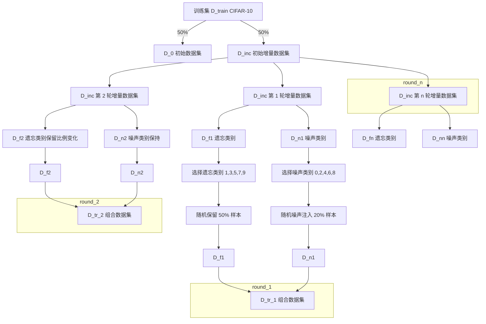
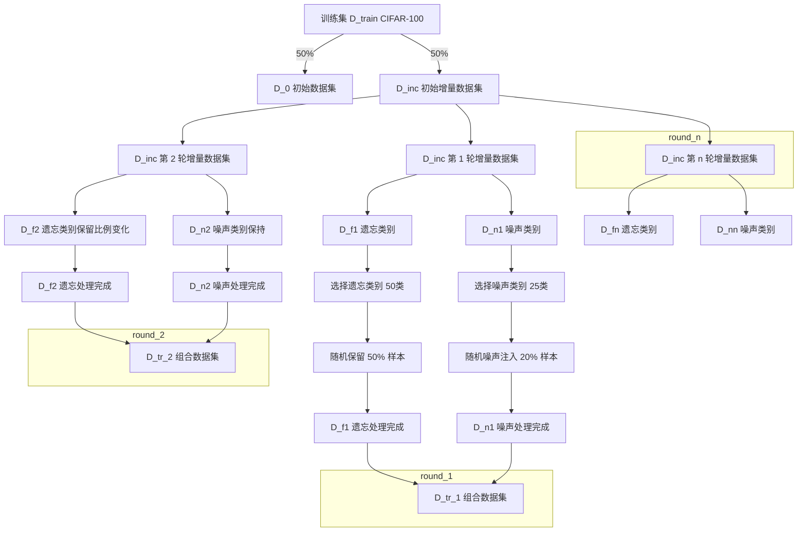

# TTA-MR

## TODO LIST

```plain


TODO 1. 保存每个 stage 的 $D_{tr}$ 的 image 和 label 。
 $D_{tr}$ npy 补充上传到网盘。
        ├── cifar10_noisy_other_class_labels.npy # 经过 20% 标签噪声处理的非遗忘类标签, 52K
        <!-- ├── cifar10_other_class_data.npy # 非遗忘类的数据，包含从 D_inc 中抽取的 50% 非遗忘类样本, 201M
        ├── cifar10_other_class_labels.npy # 非遗忘类的标签，包含非遗忘类数据的类别标签, 52K -->
        ├── cifar10_forget_class_data.npy # 遗忘类的数据，包含从 D_inc 中抽取的 10% 的遗忘类样本, 15M
        ├── cifar10_forget_class_labels.npy # 遗忘类的标签，包含对应遗忘类数据的类别标签, 12K

TODO 2. stage-1的模型保存。
TODO 3. 数据分 stage 保存。
TODO 4. run 3 轮。
TODO 5. input image: 10 images，5 rows 10 cols
TODO 6. recall-precision figures, line plot
TODO 7. www 完成 method.

1. 胡院
   1. 1-2，调通
   2. 3-6, baseline
   3. 同步记录 ablation study 的结果。
2. AILab：1-6, dataset / base model
   1. 实现 2 种噪声, sy, asy
   2. 至少 3 个数据集, CIFAR-10 CIFAR-100 TINY-200。
   3. （Animal-10 备选）从 pytorch 内置。
   4. 1 个模型 resnet 。
3. 国庆期间，所有结果 ready。
4. 分析代码和论文的图表可以在国庆期间同步实现。
5. 国庆期间 abstract ddl 。
6. 国庆期间，full paper 完成。
7. 国庆后第一周，full paper 修改完成。


```

## Preparation

### Code Structure

```bash

$pwd
/home/xxx/tta-mr/

# under tta-mr dir
$ ll
data/ # 保存所有数据（原始数据和生成数据）
ckpt/ # 保存训练模型
gen_dataset/ # 代码，生成数据
run_experiment.py # 代码，训练模型
.. # other files

$ python gen_dataset/gen_cifar10_exp_data.py --help

$ python gen_dataset/gen_cifar100_exp_data.py --help

```

### Create virtual environment

```bash
conda create -n tta-mr python=3.8
conda activate tta-mr
```

```bash
pip install -r requirements.txt
```

### Download datasets

Supported datasets are:

1. CIFAR-10
2. CIFAR-100
3. FOOD-101

```bash

$ mkdir -p data

$ ll data/
cifar-10
cifar-100
food-101
```

每个数据集的下面都包括`gen`和`normal`两个目录，分别用于存储生成的数据和原始的数据集。

- 生成的数据会自动存储在`gen`目录下。
- 原始下载的数据集手动放在`normal`目录下。

比如对于`CIFAR-10`数据集：

```bash
$ ls data/cifar-10
gen  normal

$ ls data/cifar-10/gen/
nr_0.2_nt_asymmetric  nr_0.2_nt_symmetric

$ ls data/cifar-10/normal/
batches.meta  cifar-10-batches-py  cifar-10-python.tar.gz  clean_0.5000_sym.npz  data_batch_1  data_batch_2  data_batch_3  data_batch_4  data_batch_5  readme.html  test_batch
```

### Construct Experimental Datasets

```bash

# 基于 CIFAR-10 数据集生成对称噪声
python gen_dataset/gen_cifar10_exp_data.py --data_dir ./data/cifar-10/normal --gen_dir ./data/cifar-10/gen/ --noise_type symmetric --noise_ratio 0.2 --num_versions 3 --retention_ratios 0.5 0.3 0.1

# 基于 CIFAR-10 数据集生成非对称噪声
python gen_dataset/gen_cifar10_exp_data.py --data_dir ./data/cifar-10/normal --gen_dir ./data/cifar-10/gen/ --noise_type asymmetric --noise_ratio 0.2 --num_versions 3 --retention_ratios 0.5 0.3 0.1

$ tree data/cifar-10/gen/
data/cifar-10/gen/
├── nr_0.2_nt_asymmetric
│   ├── D_0_labels.npy
│   ├── D_0.npy
│   ├── D_a_labels.npy
│   ├── D_a.npy
│   ├── D_inc_0_data.npy
│   ├── D_inc_0_labels.npy
│   ├── D_tr_data_version_1.npy
│   ├── D_tr_data_version_2.npy
│   ├── D_tr_data_version_3.npy
│   ├── D_tr_labels_version_1.npy
│   ├── D_tr_labels_version_2.npy
│   ├── D_tr_labels_version_3.npy
│   ├── test_data.npy
│   └── test_labels.npy
└── nr_0.2_nt_symmetric
    ├── D_0_labels.npy
    ├── D_0.npy
    ├── D_a_labels.npy
    ├── D_a.npy
    ├── D_inc_0_data.npy
    ├── D_inc_0_labels.npy
    ├── D_tr_data_version_1.npy
    ├── D_tr_data_version_2.npy
    ├── D_tr_data_version_3.npy
    ├── D_tr_labels_version_1.npy
    ├── D_tr_labels_version_2.npy
    ├── D_tr_labels_version_3.npy
    ├── test_data.npy
    └── test_labels.npy
```

The logic of generating dataset and validation codes to check the rightness fo generated datasts are within the following notebook:
`result_analysis/dataset_analysis.ipynb` <https://github.com/data-centric-research/tta-mr/blob/5bdddef032ea8167364ba6f05d55e1c68083314e/result_analysis/dataset_analysis.ipynb>

### Train Initial Models on Experimental Datasets

```bash

$ python run_experiment.py --help

# 基于 CIFAR-10 D_0数据集训练初始模型, model_p0.pth
CUDA_VISIBLE_DEVICES=1 python run_experiment.py --step 0 --dataset_type cifar-10 --epochs 100 --batch_size 32 --learning_rate 0.001
# load model_p0.pth
# 基于 CIFAR-10 D_tr_1数据集(D_tr_data_version_1.npy + D_tr_labels_version_1.npy)训练启动模型 model_p0.pth, 得到model_p1.pth
CUDA_VISIBLE_DEVICES=2 python run_experiment.py --step 1 --dataset_type cifar-10 --epochs 50 --batch_size 32 --learning_rate 0.001
# load model_p1.pth (当step>=2时，支持从外部load模型而不是上一个训练好的模型)
# 基于 CIFAR-10 D_tr_2数据集训练 model_p1.pth, 得到 model_p2.pth
CUDA_VISIBLE_DEVICES=3 python run_experiment.py --step 2 --dataset_type cifar-10 --epochs 50 --batch_size 32 --learning_rate 0.001
# load model_p2.pth
# 基于 CIFAR-10 D_tr_3数据集训练 model_p2.pth, 得到model_p3.pth
CUDA_VISIBLE_DEVICES=4 python run_experiment.py --step 3 --dataset_type cifar-10 --epochs 50 --batch_size 32 --learning_rate 0.001

$ tree ckpt/
ckpt/
├── cifar-10
   ├── nr_0.2_nt_asymmetric
   │   ├── model_p0.pth
   │   ├── model_p1.pth
   │   └── model_p2.pth
       └── model_p3.pth
   └── nr_0.2_nt_symmetric
       ├── model_p0.pth
       ├── model_p1.pth
       └── model_p2.pth
       └── model_p3.pth

```

## Core Experiment

TODO

## Validation

TODO

## Acknowledgements

- <https://github.com/nazmul-karim170/UNICON-Noisy-Label>
- <https://github.com/LiJunnan1992/DivideMix>
- <https://github.com/sangamesh-kodge/LabelNoiseRobustness>
- <https://github.com/sangamesh-kodge/Mini-WebVision>
- <https://github.com/sangamesh-kodge/Clothing1M>

## 构造实验数据集(CIFAR-10)

### 数据集构造目标

- 单一噪声类型：
  - 在每个增量版本中，只选择一种噪声注入方式（对称或非对称），以便明确评估噪声类型对模型的影响。

- 遗忘模拟：
  - 通过逐步减少遗忘类别的样本数量，模拟数据随时间的变化，考察模型在数据分布变化下的适应能力。

- 重放机制：s
  - 重放数据集 $D_a$ 的引入，有助于模型在增量学习过程中保持对初始数据的记忆，减轻灾难性遗忘。

- 数据集版本化：
  - 清晰地划分和保存每个版本的数据集，便于实验的重复性和结果的对比分析。

### 1. 数据集定义

- 原始训练数据集：
  
  以CIFAR-10数据集为例。

  $$  D_{\text{train}} = \{ (x_i, y_i) \mid i = 1, 2, \dots, 50000 \}$$
  其中，$x_i$ 是图像数据，$y_i \in Y = \{0, 1, \dots, 9\}$ 是对应的标签。

### 2. 初始数据集划分

- 初始数据集 $D_0$：
  从 $D_{\text{train}}$ 中随机抽取 50% 的样本：
  $$  D_0 = \{ (x_i, y_i) \mid i \in I_0 \}, \quad |I_0| = 25000$$

- 增量数据集初始版本 $D_{\text{inc}}^{(0)}$：
  剩余的样本：
  $$  D_{\text{inc}}^{(0)} = D_{\text{train}} \setminus D_0, \quad |D_{\text{inc}}^{(0)}| = 25000$$

### 3. 重放数据集 $D_a$

- 从 $D_0$ 中随机抽取 10% 的样本：
  $$  D_a = \{ (x_j, y_j) \mid j \in I_a \subset I_0 \}, \quad |D_a| = 2500$$
- 目的：用于防止模型在增量学习过程中遗忘初始知识。

### 4. 生成增量数据集 $D_{\text{inc}}^{(t)}$

对于每个增量版本 $t = 1, 2, 3$，执行以下步骤：

#### 4.1 模拟遗忘

- 遗忘类别集合：
  $$  C_f = \{1, 3, 5, 7, 9\}$$
- 保留比例 $r_t$：
  - $r_1 = 50\%$
  - $r_2 = 30\%$
  - $r_3 = 10\%$
- 构建遗忘后的数据集 $D_f^{(t)}$：
  对于每个类别 $c \in C_f$，从 $D_{\text{inc}}^{(0)}$ 中该类别的样本按保留比例 $r_t$ 随机抽取：
  $$  D_f^{(t)} = \bigcup_{c \in C_f} \{ (x_k, y_k) \mid y_k = c, k \in S_c^{(t)} \}$$
  其中，$S_c^{(t)}$ 是类别 $c$ 中按保留比例 $r_t$ 随机抽取的样本索引集合。

#### 4.2 噪声注入

- 噪声类别集合：
  $$  C_n = \{0, 2, 4, 6, 8\}$$
- 噪声比例：
  - 对于每个类别 $c \in C_n$，随机选择 20% 的样本进行噪声注入。
- 噪声类型选择：
  - 对称噪声 或 非对称噪声，在每个版本中只能选择一种。

- 构建噪声数据集 $D_n^{(t)}$：

  - 如果选择对称噪声：
    - 对于每个类别 $c \in C_n$，随机选择 20% 的样本，将其标签随机替换为其他类别（均匀分布在 $Y$ 中的其他标签）。
    - 噪声函数 $f_{\text{sym}}: Y \rightarrow Y$，满足：
      $$      f_{\text{sym}}(y) = \begin{cases}
      y', & y' \neq y, \ y' \in Y, \text{均匀随机} \\
      \end{cases}
      $$
    - 噪声数据集：
      $$      D_{n_{\text{sym}}}^{(t)} = \{ (x_m, f_{\text{sym}}(y_m)) \mid y_m = c, m \in N_c^{(t)} \} $$

      其中，$N_c^{(t)}$ 是类别 $c$ 中随机选择的 20% 样本索引集合。

  - 如果选择非对称噪声：
    - 定义类别映射 $M: Y \rightarrow Y$，仅对特定类别进行标签替换。例如：
      $$      M(c) = \begin{cases}
      c', & \text{按预定义的映射} \\
      c, & \text{否则}
      \end{cases}
      $$
    - 噪声函数：
      $$      f_{\text{asym}}(y) = M(y) $$

    - 噪声数据集：
      $$      D_{n_{\text{asym}}}^{(t)} = \{ (x_m, f_{\text{asym}}(y_m)) \mid y_m = c, m \in N_c^{(t)} \} $$

- 在版本 $t$ 中，噪声数据集为：
  $$  D_n^{(t)} = \begin{cases}
  D_{n_{\text{sym}}}^{(t)}, & \text{如果选择对称噪声} \\
  D_{n_{\text{asym}}}^{(t)}, & \text{如果选择非对称噪声}
  \end{cases}$$

### 5. 组合训练数据集 $D_{\text{tr}}^{(t)}$

- 合并数据集：
  $$  D_{\text{tr}}^{(t)} = D_a \cup D_f^{(t)} \cup D_n^{(t)}$$
- 注意：在每个增量版本中，$D_n^{(t)}$ 只包含一种噪声类型的数据。

### 6. 保存与使用

- 数据保存：
  - 将每个版本的训练数据集 $D_{\text{tr}}^{(t)}$ 和对应的标签保存为独立的 `.npy` 文件：
    - 数据部分：`cifar10_D_tr_data_version_{t}.npy`
    - 标签部分：`cifar10_D_tr_labels_version_{t}.npy`
- 测试数据集：
  - 测试数据集保持不变，用于评估模型性能。

### 样本数量示例

假设在每个增量版本中，遗忘类别和噪声类别的样本数量如下（具体数量需根据实际数据确定）：

- 遗忘类别样本数量：
  - $|D_f^{(1)}| = n_f^{(1)}$
  - $|D_f^{(2)}| = n_f^{(2)}$
  - $|D_f^{(3)}| = n_f^{(3)}$

- 噪声类别样本数量：
  - $|D_n^{(1)}| = n_n^{(1)}$
  - $|D_n^{(2)}| = n_n^{(2)}$
  - $|D_n^{(3)}| = n_n^{(3)}$

- 训练数据集总样本数量：
  $$  |D_{\text{tr}}^{(t)}| = |D_a| + |D_f^{(t)}| + |D_n^{(t)}|$$

### CIFAR-10 实验数据构造图示



### CIFAR-100 实验数据构造图示



## 训练初始模型(CIFAR-10)

### 初始模型训练目标

- 评估模型在增量学习中的表现：通过在多个数据集版本上训练模型，评估模型的泛化能力和在处理不同数据分布时的适应性。
- 考察灾难性遗忘问题：通过引入 $D_a$ 和逐步减少数据量，考察模型在增量学习中的遗忘情况。
- 研究噪声对模型性能的影响：通过对比对称噪声和非对称噪声对模型训练的影响，分析噪声类型对模型性能的不同作用。

### 1. 启动模型

- 采用 ResNet-18 作为模型的基础结构：
  $$ M_p = \text{ResNet18}(Y) $$
  其中，$Y = \{0, 1, \dots, 9\}$ 表示 CIFAR-10 数据集的类别标签。

- 模型 $M_p$ 通过随机初始化得到初始模型 $M_{p0}$。

### 2. 训练流程

训练过程分为多个步骤，每个步骤中使用不同的数据集进行训练。

#### Step 0：训练启动模型 $M_{p0}$

训练数据集：使用 $D_0$ 数据集训练启动模型 $M_{p0}$。$D_0$ 是从原始训练数据集中随机抽取的 50% 样本。

$$ M_{p0} \leftarrow \text{Train}(M_{\text{ResNet18}}, D_0, \text{test data}, \text{epochs}=100, \text{batch size}=32, \text{learning rate}=0.001) $$

- $M_{\text{ResNet18}}$ 是初始化的 ResNet-18 模型。
- $D_0$ 是训练数据集。
- 测试数据保持不变，用于评估模型在测试集上的性能。

保存模型：
$$ \text{Save}(M_{p0}, \text{path} = \text{model_p0.pth}) $$

#### Step 1：训练模型 $M_{p1}$

<!-- 训练数据集：使用 $D_{\text{tr}}^{(1)} = D_a \cup D_f^{(1)} \cup D_n^{(1)}$ 训练模型 $M_{p1}$。模型 $M_{p1}$ 是在 $M_{p0}$ 的基础上继续训练的。 -->
训练数据集：使用 $D_{\text{tr}}^{(1)} = D_f^{(1)} \cup D_n^{(1)}$ 训练模型 $M_{p1}$。模型 $M_{p1}$ 是在 $M_{p0}$ 的基础上继续训练的。

- 数据集 $D_{\text{tr}}^{(1)}$ 组成：
  - 重放数据集：$D_a$ 是从 $D_0$ 中随机抽取的 10% 样本。
  - 遗忘后的数据集：$D_f^{(1)}$ 是从 $D_{\text{inc}}^{(0)}$ 中根据保留比例 $r_1 = 50\%$ 选择的样本。
  - 噪声数据集：$D_n^{(1)}$ 是对称或非对称噪声注入的版本，根据配置确定。

$$ M_{p1} \leftarrow \text{Train}(M_{p0}, D_{\text{tr}}^{(1)}, \text{test data}, \text{epochs}=50, \text{batch size}=32, \text{learning rate}=0.001) $$

保存模型：
$$ \text{Save}(M_{p1}, \text{path} = \text{model_p1.pth}) $$

M_{p1} 放到指定的目录 tta-mr../data/data_set_name/inc/D_f+D_n

# baseline
-rw-rw-rw- 1 suizhihao suizhihao  91914368 Sep 23 13:32 cifar-10_inc_data.npy
-rw-rw-rw- 1 suizhihao suizhihao     59968 Sep 23 13:32 cifar-10_inc_labels.npy
-rw-rw-rw- 1 suizhihao suizhihao 122880128 Sep 22 12:19 cifar-10_test_data.npy
-rw-rw-rw- 1 suizhihao suizhihao     80128 Sep 22 12:19 cifar-10_test_labels.npy
-rw-rw-rw- 1 suizhihao suizhihao 307200128 Sep 22 12:19 cifar-10_train_data.npy
-rw-rw-rw- 1 suizhihao suizhihao    200128 Sep 22 12:19 cifar-10_train_labels.npy

# our method:tta-mr 同级的 data 目录下的子目录

-rw-rw-rw- 1 suizhihao suizhihao  91914368 Sep 23 13:32 cifar-10_inc_data.npy
-rw-rw-rw- 1 suizhihao suizhihao     59968 Sep 23 13:32 cifar-10_inc_labels.npy
-rw-rw-rw- 1 suizhihao suizhihao  91914368 Sep 23 13:32 cifar-10_aux_data.npy
-rw-rw-rw- 1 suizhihao suizhihao     59968 Sep 23 13:32 cifar-10_aux_labels.npy
-rw-rw-rw- 1 suizhihao suizhihao 122880128 Sep 22 12:19 cifar-10_test_data.npy
-rw-rw-rw- 1 suizhihao suizhihao     80128 Sep 22 12:19 cifar-10_test_labels.npy
-rw-rw-rw- 1 suizhihao suizhihao 307200128 Sep 22 12:19 cifar-10_train_data.npy
-rw-rw-rw- 1 suizhihao suizhihao    200128 Sep 22 12:19 cifar-10_train_labels.npy
<!-- 
#### Step 2：训练模型 $M_{p2}$

<!-- 训练数据集：使用 $D_{\text{tr}}^{(2)} = D_a \cup D_f^{(2)} \cup D_n^{(2)}$ 训练模型 $M_{p2}$。模型 $M_{p2}$ 是在 $M_{p1}$ 的基础上继续训练的。 -->
训练数据集：使用 $D_{\text{tr}}^{(2)} = D_f^{(2)} \cup D_n^{(2)}$ 训练模型 $M_{p2}$。模型 $M_{p2}$ 是在 $M_{p1}$ 的基础上继续训练的。

loaded model 变为 M_{p1}_{repaired}

core_model, core.py
working_model/after_adapt

- 数据集 $D_{\text{tr}}^{(2)}$ 组成：
  - 重放数据集：$D_a$ 保持不变。
  - 遗忘后的数据集：$D_f^{(2)}$ 是从 $D_{\text{inc}}^{(0)}$ 中根据保留比例 $r_2 = 30\%$ 选择的样本。
  - 噪声数据集：$D_n^{(2)}$ 是对称或非对称噪声注入的版本。

$$ M_{p2} \leftarrow \text{Train}(M_{p1}, D_{\text{tr}}^{(2)}, \text{test data}, \text{epochs}=50, \text{batch size}=32, \text{learning rate}=0.001) $$

保存模型：
$$ \text{Save}(M_{p2}, \text{path} = \text{model_p2.pth}) $$

#### Step 3：训练模型 $M_{p3}$

训练数据集：使用 $D_{\text{tr}}^{(3)} = D_a \cup D_f^{(3)} \cup D_n^{(3)}$ 训练模型 $M_{p3}$。模型 $M_{p3}$ 是在 $M_{p2}$ 的基础上继续训练的。

- 数据集 $D_{\text{tr}}^{(3)}$ 组成：
  - 重放数据集：$D_a$ 保持不变。
  - 遗忘后的数据集：$D_f^{(3)}$ 是从 $D_{\text{inc}}^{(0)}$ 中根据保留比例 $r_3 = 10\%$ 选择的样本。
  - 噪声数据集：$D_n^{(3)}$ 是对称或非对称噪声注入的版本。

$$ M_{p3} \leftarrow \text{Train}(M_{p2}, D_{\text{tr}}^{(3)}, \text{test data}, \text{epochs}=50, \text{batch size}=32, \text{learning rate}=0.001) $$

保存模型：
$$ \text{Save}(M_{p3}, \text{path} = \text{model_p3.pth}) $$ -->

---

### 整体流程总结

1. 启动模型训练（Step 0）：
   使用初始数据集 $D_0$ 训练启动模型 $M_{p0}$。

2. 增量模型训练（Step 1, 2, 3...）：
   在每个步骤 $t$，基于上一个训练好的模型 $M_{p(t-1)}$，使用增量数据集 $D_{\text{tr}}^{(t)}$ 进行训练，生成新的模型 $M_{p(t)}$。

3. 重放机制：
   通过引入重放数据集 $D_a$ 来减轻模型的灾难性遗忘问题，保持对初始知识的记忆。

4. 噪声注入与遗忘模拟：
   每个增量版本的数据集同时包含遗忘后的数据 $D_f^{(t)}$ 和带噪声的数据 $D_n^{(t)}$，并且每个版本只能包含一种噪声类型（对称或非对称）。

## 构造实验数据集(CIFAR-100)

### 数据集构造目标

1. 噪声类型的注入：
   - 通过对称或非对称噪声注入的方式，测试噪声对模型增量学习的影响。
   - 每个增量版本只选择一种噪声类型进行注入，确保在不同噪声条件下分析模型的表现。

2. 遗忘模拟：
   - 随着增量学习的进行，逐渐减少特定类别的样本数量，模拟模型对部分类别的逐渐遗忘，并分析其对模型的表现影响。

3. 重放机制：
   - 通过引入重放数据集 $D_a$，防止模型在增量学习中发生灾难性遗忘，保持对初始数据集的记忆。

4. 数据集版本化：
   - 对数据集进行多版本划分并保存，以便后续实验的重复性及结果对比。

### 1. 数据集定义

- 原始训练数据集：
  
 | 细分切

  以 CIFAR-100 为例，每个类别有 500 张训练样本和 100 张测试样本，整个训练集包含 50,000 张图像。
  
  $$ D_{\text{train}} = \{(x_i, y_i) \mid i = 1, 2, \dots, 50000 \}$$

  其中，$x_i$ 是图像数据，$y_i \in Y = \{0, 1, \dots, 99\}$ 是对应的标签。

### 2. 初始数据集划分

- 初始数据集 $D_0$：
  从 $D_{\text{train}}$ 中随机抽取 50% 的样本作为初始数据集：
  
  $$ D_0 = \{ (x_i, y_i) \mid i \in I_0 \}, \quad |I_0| = 25000 $$

- 增量数据集初始版本 $D_{\text{inc}}^{(0)}$：
  剩余的 50% 样本用于增量学习：
  
  $$ D_{\text{inc}}^{(0)} = D_{\text{train}} \setminus D_0, \quad |D_{\text{inc}}^{(0)}| = 25000 $$

### 3. 重放数据集 $D_a$

｜ 每个类抽取

- 从 $D_0$ 中随机抽取 10% 的样本，构成重放数据集 $D_a$，以缓解模型在增量学习中的遗忘问题：
  
  $$ D_a = \{(x_j, y_j) \mid j \in I_a \subset I_0 \}, \quad |D_a| = 2500 $$

### 4. 生成增量数据集 $D_{\text{inc}}^{(t)}$

对于每个增量版本 $t = 1, 2, 3$，执行以下步骤：

#### 4.1 模拟遗忘

- 遗忘类别集合：
  
  从 CIFAR-100 的 100 个类别中选择 50 个类别作为遗忘类别：
  
  $$ C_f = \{c_1, c_2, \dots, c_{50}\}$$

- 保留比例 $r_t$：
  
  设置三个增量版本的保留比例：
  
  - $r_1 = 50\%$
  - $r_2 = 30\%$
  - $r_3 = 10\%$

- 构建遗忘后的数据集 $D_f^{(t)}$：
  
  对于每个类别 $c \in C_f$，从 $D_{\text{inc}}^{(0)}$ 中按保留比例 $r_t$ 随机抽取样本，构建遗忘数据集：
  
  $$ D_f^{(t)} = \bigcup_{c \in C_f} \{ (x_k, y_k) \mid y_k = c, k \in S_c^{(t)} \}$$
  
  其中，$S_c^{(t)}$ 是类别 $c$ 中按保留比例 $r_t$ 抽取的样本索引集合。

#### 4.2 噪声注入

- 噪声类别集合：
  
  从剩余的 50 个类别中选择一部分类别（如 25 个）作为噪声类别：
  
  $$ C_n = \{c_{51}, c_{52}, \dots, c_{75}\}$$

- 噪声比例：
  
  对于每个类别 $c \in C_n$，选择 20% 的样本进行噪声注入。

- 噪声类型选择：
  
  在每个版本中，选择一种噪声注入类型：
  
  - 对称噪声：随机将 20% 的样本标签替换为其他类别标签（均匀分布在所有类别中）。
  - 非对称噪声：定义固定的标签映射，将 20% 的样本标签替换为特定的其他标签。

- 构建噪声数据集 $D_n^{(t)}$：

  1. 对称噪声：
     
     对于类别 $c \in C_n$，从 20% 的样本中随机替换标签，噪声函数定义为：
     
     $$ f_{\text{sym}}(y) = \begin{cases}
     y', & y' \neq y, \ y' \in Y \text{（均匀随机）} \\
     \end{cases}$$

     噪声数据集为：
     $$ D_{n_{\text{sym}}}^{(t)} = \{ (x_m, f_{\text{sym}}(y_m)) \mid y_m = c, m \in N_c^{(t)} \} $$

  2. 非对称噪声：
   
   **对于 c100, f101，选择 单向 10 个（5 个 mapping 关系）**
     
     定义类别映射 $M: Y \rightarrow Y$，将特定类别的标签替换为指定类别的标签：
     
     $$ M(c) = \begin{cases}
     c', & \text{按预定义映射} \\
     c, & \text{否则}
     \end{cases}$$
     
     噪声函数为：
     $$ f_{\text{asym}}(y) = M(y) $$

     噪声数据集为：
     $$ D_{n_{\text{asym}}}^{(t)} = \{ (x_m, f_{\text{asym}}(y_m)) \mid y_m = c, m \in N_c^{(t)} \} $$

- 增量版本中的噪声数据集：
  $$ D_n^{(t)} = \begin{cases}
  D_{n_{\text{sym}}}^{(t)}, & \text{如果选择对称噪声} \\
  D_{n_{\text{asym}}}^{(t)}, & \text{如果选择非对称噪声}
  \end{cases}$$

### 5. 组合训练数据集 $D_{\text{tr}}^{(t)}$

- 合并训练数据集：
  
  在每个增量版本 $t$ 中，将重放数据集 $D_a$、遗忘类别样本集 $D_f^{(t)}$ 和噪声数据集 $D_n^{(t)}$ 合并，构成训练数据集：
  
  <!-- $$ D_{\text{tr}}^{(t)} = D_a \cup D_f^{(t)} \cup D_n^{(t)}$$ -->
  $$ D_{\text{tr}}^{(t)} = D_f^{(t)} \cup D_n^{(t)}$$

- 每个增量版本只包含一种噪声类型的数据。

### 6. 数据集保存与使用

- 保存数据集：
  
  将每个增量版本的数据集保存为独立的 `.npy` 文件，包含数据和标签：

  - 数据文件：`cifar100_D_tr_data_version_{t}.npy`
  - 标签文件：`cifar100_D_tr_labels_version_{t}.npy`

- 测试数据集保持不变：
  
  测试数据集在每个版本中保持不变，用于评估模型的泛化性能。

### 样本数量示例

假设在每个增量版本中，遗忘类别和噪声类别的样本数量如下：

- 遗忘类别样本数量：
  - $|D_f^{(1)}| = n_f^{(1)}$
  - $|D_f^{(2)}| = n_f^{(2)}$
  - $|D_f^{(3)}| = n_f^{(3)}$

- 噪声类别样本数量：
 

 - $|D_n^{(1)}| = n_n^{(1)}$
  - $|D_n^{(2)}| = n_n^{(2)}$
  - $|D_n^{(3)}| = n_n^{(3)}$

- 训练数据集总样本数量：
  $$ |D_{\text{tr}}^{(t)}| = |D_a| + |D_f^{(t)}| + |D_n^{(t)}| $$

### 7. 其他考虑

- 数据集均衡性：
  
  CIFAR-100 数据集相比 CIFAR-10 具有更多的类别，因此实验设计中需要关注类别不平衡问题，尤其是在遗忘和噪声注入过程中要保证不同类别的样本数量不会严重失衡。

- 实验对比：
  
  通过调整噪声比例、遗忘类别和保留比例，可以设计不同的实验组，评估不同条件下模型在增量学习过程中的表现。

## 构造实验数据集(FOOD-101)

### 数据集构造目标

- 单一噪声类型：
  - 在每个增量版本中，只选择一种噪声注入方式（对称或非对称），以评估噪声类型对模型的影响。

- 遗忘模拟：
  - 逐步减少特定类别的样本数量，模拟数据随时间变化，考察模型在数据分布变化下的适应性。

- 重放机制：
  - 通过引入重放数据集 $D_a$，帮助模型在增量学习过程中记忆初始数据，减少灾难性遗忘。

- 数据集版本化：
  - 清晰划分并保存每个版本的数据集，以便进行重复实验和对比分析。

### 1. 数据集定义

- 原始训练数据集：
  FOOD-101 数据集包含 101,000 张图像，涵盖 101 种食物类别。每类包含 750 张训练图像 和 250 张测试图像。训练图像总共有 75,750 张图像，测试图像总共有 25,250 张图像。

  $$ D_{\text{train}} = (x_i, y_i) \mid i = 1, 2, \dots, 75750 $$
  其中，$x_i$ 是图像数据，$y_i \in Y = \{0, 1, \dots, 100\}$ 是对应的类别标签。

### 2. 初始数据集划分

- 初始数据集 $D_0$：
  从 $D_{\text{train}}$ 中随机抽取 50% 的类别（即 51 类，约 38,250 张图像），作为初始训练数据集。

  $$ D_0 = (x_i, y_i) \mid i \in I_0 \subset D_{\text{train}}, \quad |I_0| = 38250 $$

- 初始增量数据集 $D_{\text{inc}}^{(0)}$：
  其余 50% 的类别（即 50 类，约 37,500 张图像）保留，用于后续增量学习。

  $$ D_{\text{inc}}^{(0)} = D_{\text{train}} \setminus D_0, \quad |D_{\text{inc}}^{(0)}| = 37500 $$

### 3. 重放数据集 $D_a$

- 重放数据集：
  从 $D_0$ 中随机抽取 10% 的样本，形成重放数据集 $D_a$，用于在增量学习过程中减轻模型遗忘。

  $$ D_a = (x_j, y_j) \mid j \in I_a \subset I_0, \quad |D_a| = 3825 $$

### 4. 生成增量数据集 $D_{\text{inc}}^{(t)}$

对于每个增量版本 $t = 1, 2, 3$，执行以下步骤：

#### 4.1 模拟遗忘

- 遗忘类别集合 $C_f$：从 $D_{\text{inc}}^{(0)}$ 中选择 10 类 作为遗忘类别。

- 保留比例 $r_t$：
  - $ r_1 = 50\% $（第 1 轮）：保留 50% 的遗忘类别样本。
  - $ r_2 = 30\% $（第 2 轮）：保留 30% 的遗忘类别样本。
  - $ r_3 = 10\% $（第 3 轮）：保留 10% 的遗忘类别样本。

- 构建遗忘后的数据集 $D_f^{(t)}$：
  对每个类别 $c \in C_f$，按保留比例 $r_t$ 随机抽取样本，形成遗忘类别数据集。

  $$ D_f^{(t)} = \bigcup_{c \in C_f} (x_k, y_k) \mid y_k = c, k \in S_c^{(t)} $$

#### 4.2 噪声注入

- 噪声类别集合 $C_n$：从 $D_0$ 中选择 20 类 作为噪声类别。

- 噪声比例：对每个类别随机选择 20% 的样本进行噪声注入。

- 噪声类型选择：
  - 对称噪声：标签随机替换为其他类别。
  - 非对称噪声：按固定类别映射规则替换标签。

- 构建噪声数据集 $D_n^{(t)}$：
  - 对称噪声：标签随机替换。
  - 非对称噪声：按照预设的类别映射替换标签。

  $$ D_n^{(t)} = (x_m, f(y_m)) \mid y_m = c, m \in N_c^{(t)} $$

### 5. 组合训练数据集 $D_{\text{tr}}^{(t)}$

- 合并数据集：
  $$ D_{\text{tr}}^{(t)} = D_a \cup D_f^{(t)} \cup D_n^{(t)} $$

  - $D_{\text{tr}}^{(t)}$ 仅包含一种噪声类型的数据。

### 6. 保存与使用

- 数据保存：
  每个版本的数据集保存为 `.npy` 文件，文件命名格式为 `food101_D_tr_data_version_{t}.npy` 和 `food101_D_tr_labels_version_{t}.npy`。

- 测试数据集保持不变：
  测试集使用 FOOD-101 的标准测试数据，不随增量版本变化。

### 样本数量示例

假设在每个增量版本中，遗忘类别和噪声类别的样本数量如下：

- 遗忘类别样本数量：
  - $ |D_f^{(1)}| = n_f^{(1)} $
  - $ |D_f^{(2)}| = n_f^{(2)} $
  - $ |D_f^{(3)}| = n_f^{(3)} $

- 噪声类别样本数量：
  - $ |D_n^{(1)}| = n_n^{(1)} $
  - $ |D_n^{(2)}| = n_n^{(2)} $
  - $ |D_n^{(3)}| = n_n^{(3)} $

- 训练数据集总样本数量：
  $$ |D_{\text{tr}}^{(t)}| = |D_a| + |D_f^{(t)}| + |D_n^{(t)}| $$

